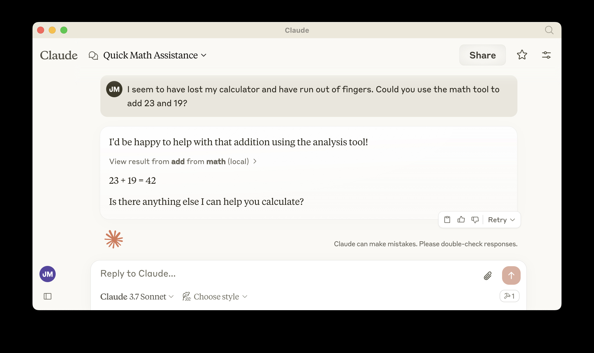

# Snappy MCP Server with Xano Integration

A remote MCP server built on Cloudflare Workers with Xano database integration for tool management, session tracking, and OAuth. Now with full support for the latest Streamable HTTP transport protocol (2024-11-05).

## Develop locally

```bash
# clone the repository
git clone https://github.com/roboulos/remote-mcp-server.git

# install dependencies
cd remote-mcp-server
npm install

# Configure Xano API Key
# Add your Xano API key to wrangler.jsonc in the XANO_API_KEY variable

# run locally
npm run dev
```

You should be able to open [`http://localhost:8787/`](http://localhost:8787/) in your browser

## Connect to your MCP server

### Using the MCP Inspector (legacy)

To explore your new MCP API with the older SSE transport, you can use the [MCP Inspector](https://modelcontextprotocol.io/docs/tools/inspector).

- Start it with `npx @modelcontextprotocol/inspector`
- [Within the inspector](http://localhost:5173), switch the Transport Type to `SSE` and enter `http://localhost:8787/sse` as the URL of the MCP server to connect to, and click "Connect"
- You will navigate to a (mock) user/password login screen. Input any email and pass to login.
- You should be redirected back to the MCP Inspector and you can now list and call any defined tools!

### Using Workers AI Playground (Streamable HTTP)

To test with the latest Streamable HTTP transport protocol:

1. Visit the [Workers AI Playground](https://workers.cloudflare.com/ai/playground)
2. When prompted to connect to an MCP server, enter your endpoint URL:
   ```
   https://remote-mcp-server.robertjboulos.workers.dev/mcp
   ```
   or for local testing:
   ```
   http://localhost:8787/mcp
   ```
3. Provide authentication credentials when prompted:
   - **auth_token**: Your Xano authentication token
   - **user_id**: Your Xano user ID
4. The Playground will handle session management automatically using the new protocol

<div align="center">
  
</div>

<div align="center">
  
</div>

## Connect Claude Desktop to your local MCP server

### Legacy SSE Transport

To connect using the older SSE transport, follow [Anthropic's Quickstart](https://modelcontextprotocol.io/quickstart/user) and within Claude Desktop go to Settings > Developer > Edit Config to find your configuration file.

Open the file in your text editor and replace it with this configuration:

```json
{
  "mcpServers": {
    "math": {
      "command": "npx",
      "args": [
        "mcp-remote",
        "http://localhost:8787/sse"
      ]
    }
  }
}
```

This will run a local proxy and let Claude talk to your MCP server over HTTP.

### Streamable HTTP Transport (Recommended)

To use the newer, more efficient Streamable HTTP transport with Claude Desktop, update your configuration to use the `/mcp` endpoint instead:

```json
{
  "mcpServers": {
    "xano": {
      "remoteUrl": "http://localhost:8787/mcp",
      "auth": {
        "type": "bearer",
        "token": "YOUR_XANO_AUTH_TOKEN"
      },
      "headers": {
        "x-user-id": "YOUR_USER_ID"
      }
    }
  }
}
```

Replace `YOUR_XANO_AUTH_TOKEN` and `YOUR_USER_ID` with your actual credentials.

When you open Claude a browser window should open and allow you to login. You should see the tools available in the bottom right. Given the right prompt Claude should ask to call the tool.

<div align="center">
  
</div>

<div align="center">
  
</div>

## Xano Integration

This MCP server uses Xano as its backend for:

1. **Tool Management**: Define tools in Xano's `____mcp_tools` table and they will be automatically registered in the MCP server
2. **Session Tracking**: All MCP sessions are tracked in the `___mcp_sessions` table with unique session IDs
3. **OAuth Authentication**: OAuth tokens and states are stored in Xano's `___oauth_tokens` and `___oauth_states` tables
4. **Logging**: All MCP requests are logged in the `___mcp_logs` table

## Streamable HTTP Implementation

This server implements the latest Model Context Protocol Streamable HTTP transport (2024-11-05) with the following features:

### Authentication Methods

The server supports multiple authentication mechanisms for maximum compatibility:

1. **URL Parameters**: `?auth_token=xxx&user_id=yyy` (legacy method)
2. **Authorization Header**: `Authorization: Bearer xxx` with `x-user-id` header (modern method)
3. **Request Body**: Auth parameters can be included in the initialization payload

### Session Management

The server handles session IDs according to the latest spec:

1. **Session Creation**: The server generates a unique session ID for new connections
2. **Session Tracking**: Clients store this ID and include it in future requests as `?sessionId=xxx`
3. **State Persistence**: Each session maintains its own state in Xano, which persists across requests

### Protocol Compliance

The implementation includes proper support for:

1. **Unified Message Endpoint**: Support for the `/mcp/message` endpoint pattern
2. **Protocol Headers**: All responses include proper headers like `MCP-Available-Transports`
3. **SSE Streaming**: Enhanced SSE support for streaming responses
4. **Response Format**: Standard JSON-RPC 2.0 format with protocol-specific extensions

### Setting up Xano

1. Create a Xano project with the required tables (see database schema)
2. Create API endpoints for:
   - `/api/tools` - GET - List all tools
   - `/api/tools/execute/{tool_name}` - POST - Execute a specific tool
   - `/api/sessions` - POST - Create a new session
   - `/api/sessions/update-activity` - PUT - Update session activity
   - `/api/oauth/tokens` - POST - Store OAuth tokens
   - `/api/oauth/tokens/{user_id}/{provider}` - GET - Get OAuth tokens
   - `/api/oauth/states` - POST - Store OAuth states
   - `/api/oauth/states/{state}` - GET - Validate OAuth states
   - `/api/logs` - POST - Log MCP requests

## Deploy to Cloudflare

1. `npx wrangler kv namespace create OAUTH_KV`
2. Follow the guidance to add the kv namespace ID to `wrangler.jsonc`
3. Add your Xano API key to the `XANO_API_KEY` variable in `wrangler.jsonc`
4. `npm run deploy`

## Call your newly deployed remote MCP server from a remote MCP client

Just like you did above in "Develop locally", run the MCP inspector:

`npx @modelcontextprotocol/inspector@latest`

Then enter the `workers.dev` URL (ex: `worker-name.account-name.workers.dev/sse`) of your Worker in the inspector as the URL of the MCP server to connect to, and click "Connect".

You've now connected to your MCP server from a remote MCP client.

## Connect Claude Desktop to your remote MCP server

Update the Claude configuration file to point to your `workers.dev` URL (ex: `worker-name.account-name.workers.dev/sse`) and restart Claude 

```json
{
  "mcpServers": {
    "math": {
      "command": "npx",
      "args": [
        "mcp-remote",
        "https://worker-name.account-name.workers.dev/sse"
      ]
    }
  }
}
```

## Debugging

Should anything go wrong it can be helpful to restart Claude, or to try connecting directly to your
MCP server on the command line with the following command.

```bash
npx mcp-remote http://localhost:8787/sse
```

In some rare cases it may help to clear the files added to `~/.mcp-auth`

```bash
rm -rf ~/.mcp-auth
```
